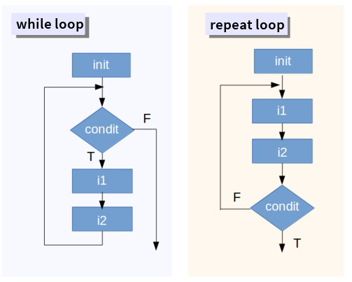
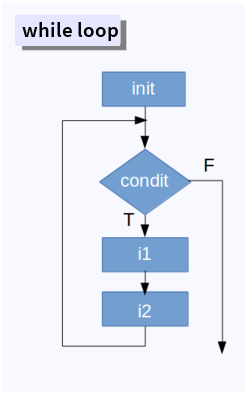

<style>
body
  { counter-reset: source-line 0; }
pre.numberSource code
  { counter-reset: none; }
</style>


```{r setting functions and parameters, echo=FALSE, message=FALSE}

# remove all objects
rm(list = ls())

# unload all non-based packages
out <- sapply(paste('package:', names(sessionInfo()$otherPkgs), sep = ""), function(x) try(detach(x, unload = FALSE, character.only = TRUE), silent = T))


options("digits"=5)
options("digits.secs"=3)
 
library(knitr)
library(kableExtra)

options(knitr.table.format = "html") 

x <- c("RColorBrewer", "ggplot2", "xaringanExtra")

aa <- lapply(x, function(y) {
  if(!y %in% installed.packages()[,"Package"])  {if(y != "warbleR") install.packages(y) else devtools::install_github("maRce10/warbleR")
}
try(require(y, character.only = T), silent = T)
  })


theme_set(theme_classic(base_size = 50))

cols <- brewer.pal(10,"Spectral")

# options to customize chunk outputs
knitr::opts_chunk$set(
  class.source = "numberLines lineAnchors", # for code line numbers
  tidy.opts = list(width.cutoff = 65), 
  tidy = TRUE,
  message = FALSE
 )

htmltools::tagList(
  xaringanExtra::use_clipboard(
    button_text = "<i class=\"fa fa-clipboard\"></i>",
    success_text = "<i class=\"fa fa-check\" style=\"color: #90BE6D\"></i>",
    error_text = "<i class=\"fa fa-times-circle\" style=\"color: #F94144\"></i>"
  ),
  rmarkdown::html_dependency_font_awesome()
)
```
 
<!-- skyblue box -->

<div class="alert alert-info">

# Objetivo del manual

- Aprender a procesar de forma serial operaciones que deben repetirse sobre diferentes objetos

</div>

&nbsp; 
 
## Bucles (loops) 

- Proceso automatizado de varios pasos organizado como secuencias de acciones (p. Ej., procesos 'por lotes')
- Se usa para acelerar los procedimientos en los que se aplica la misma acción a muchos objetos (similares)
- Crítico para la gestión de grandes bases de datos ('big data', y buenas prácticas de programación)


2 tipos básicos:

   1) Ejecutar hasta que se cumpla una condición predefinida (bucles `while` y` repeat`)


```{r, echo=FALSE,out.width="60%", fig.align="center"}



```
&nbsp;

<font size = "2"> * Modificado de <i> Tutorial de bucles Datacamp </i> </font>
&nbsp;

  2) Ejecutar para un número predefinido de iteraciones (es decir, tiempos). 2 tipos:
       a) Los resultados pueden ingresarse nuevamente en la siguiente iteración (bucles `for`)
       b) Los resultados de una interacción no pueden afectar a otras iteraciones (`(X) aplica`) 

```{r, echo=FALSE,out.width="40%"}

knitr::include_graphics("./images/loops2.png")

```

&nbsp;

*Nota: cuando el resultado de una iteración es completamente independiente de otras iteraciones, la tarea podría ejecutarse en paralelo. Hablaremos sobre computación paralela durante la clase de "codigo eficiente"*

&nbsp;


## Bucles 'While'

Los bucles `while` aplican una acción (1 o más funciones) en una secuencia de elementos hasta que se cumpla una condición. La condición puede evaluar un resultado del propio ciclo o una entrada externa:

```{r, echo=FALSE,out.width="70%"}



```

El siguiente ciclo `while` se ejecuta hasta que la correlación de las variables continuas generadas al azar es mayor que un umbral:

```{r, eval=F, echo=T}

# definir valor inicial
corr_coef <- 0

# iniciar bucle
while(corr_coef < 0.5) {
  
  # generar la variable 1
  v1 <- rnorm(n = 20, mean = 100, sd = 20)

  # generar la variable 2
  v2 <- rnorm(n = 20, mean = 100, sd = 20)
  
  # corrrer  la correlacion
  corr_coef <- cor(v1, v2)

  # imprimir
  print(corr_coef)
  }

corr_coef

```

```{r, eval=T, echo=F}

# set default value as 0
corr_coef <- 0
cc <- NULL
while(corr_coef < 0.5) {
  
  set.seed(length(cc) + 1)
  
  # generate variable 1
  v1 <- rnorm(n = 20, mean = 100, sd = 20)

    set.seed(length(cc) + 100)

  # generate variable 2
  v2 <- rnorm(n = 20, mean = 100, sd = 20)
  
  # run correlation
  corr_coef <- cor(v1, v2)
cc <- append(cc, corr_coef)
  }

if(length(cc) > 10)
cc <- cc[(length(cc) - 10):length(cc)]

print(cc)

```


&nbsp;

Para guardar cada uno de los resultados hay 2 opciones:

   - Usando la función `append`
   - Agregar nuevos elementos a un vector usando indexación


Usando `append`:

```{r, eval=T, echo=T}

# definir valor inicial
corr_coef <- 0

# crear vector vacio
cc_vector <- NULL

while(corr_coef < 0.5) {
  
  # generar la variable 1
  v1 <- rnorm(n = 20, mean = 100, sd = 20)

  # generar la variable 2
  v2 <- rnorm(n = 20, mean = 100, sd = 20)
  
  # correr la correlacion
  corr_coef <- cor(v1, v2)

  # guardar resultado  usando append
  cc_vector <- append(cc_vector, corr_coef)
  
  }

head(cc_vector)

```
&nbsp;


Podemos graficar el resultado como el gráfico anterior así:
```{r, eval=T, echo=T}

library(ggplot2)

cc <- data.frame(y = cc_vector, x = 1:length(cc_vector))

ggplot(data = cc, aes(x, y)) +
  geom_hline(yintercept = 0.5, col = cols[4], lwd = 3) +
  geom_line(col = cols[8], lwd = 4) + 
  labs(x = "Iteraciones", y = "Correlación de pearson (r)") + 
  theme_classic(base_size = 25)

```

Usando indexación:

```{r, eval=T, echo=T}

# definir valor inicial
corr_coef <- 0

# crear vector vacio
cc_vector <- NULL

while(corr_coef < 0.5) {
  
  # generar la variable 1
  v1 <- rnorm(n = 20, mean = 100, sd = 20)

  # generar la variable 2
  v2 <- rnorm(n = 20, mean = 100, sd = 20)
  
  # correr correlacion
  corr_coef <- cor(v1, v2)

  # guardar vector
  cc_vector[length(cc_vector) + 1] <- corr_coef
  
  }

head(cc_vector)

```
&nbsp;

  Pero tenga en cuenta que `append` puede ser muy lento (no recomendado)

&nbsp;


Con un pequeño ajuste, un bucle `while` también puede evaluar varias condiciones a la vez. Por ejemplo, también podemos incluir altos valores de correlación negativa:


```{r, eval=T, echo=T}

# definir valor inicial
corr_coef <- 0

# crear vector vacio
cc_vector <- NULL

while(corr_coef < 0.5 & corr_coef > -0.5) {
  
  # generar la variable 1
  v1 <- rnorm(n = 20, mean = 100, sd = 20)

  # generar la variable 2
  v2 <- rnorm(n = 20, mean = 100, sd = 20)
  
  # correr correlacion
  corr_coef <- cor(v1, v2)

  # guardar resultados
  cc_vector[length(cc_vector) + 1] <- corr_coef
  
  }

head(cc_vector)

```
&nbsp;


```{r, eval=T, echo=F, message=F, warning=F}
cc <- cc_vector
cc <- data.frame(y = cc, x = 1:length(cc))

if(nrow(cc) > 50)
cc <- cc[(nrow(cc) -50):nrow(cc),]
  
  ggplot(data = cc, aes(x, y)) +
  geom_hline(yintercept = c(-0.5, 0.5), col = cols[4], lwd = 3) +
  geom_line(col = cols[8], lwd = 4) + 
  labs(x = "Iteraciones", y = "Correlación de pearson (r)") + 
  theme_classic(base_size = 25)

```


---

<div class="alert alert-info">

<font size="5">Ejercicio 1</font> 

</br>
1.1 Haga un bucle `while` que se detenga solo si la correlación es mayor que 0.5 pero menor que 0.55

</br>

   1.2 Haga un bucle `while` que se detenga si la correlación es superior a 0.8 o si el bucle ha estado ejecutándose durante más de 10 segundos (consejo: use la función` difftime` y / o `as.numeric`)
  
</div>

---

##  Bucles 'repeat'

Los bucles `repeat` también deben cumplir una condición para detenerse. Muy parecido a los bucles `while`. Sin embargo, se realiza para que la acción se ejecute al menos una vez, independientemente de la evaluación de la condición

<p style = "text-align: center;">  </p>
&nbsp;


El siguiente bucle `repeat` hace lo mismo que el bucle` while` anterior:
```{r, eval=T, echo=T}

# crear vector vacio
cc_vector <- NULL

repeat
{
  # generar la variable 1
  v1 <- rnorm(n = 20, mean = 100, sd = 20)

  # generar la variable 2
  v2 <- rnorm(n = 20, mean = 100, sd = 20)
  
  # correr la correlacion
  corr_coef <- cor(v1, v2)

  # guardar resultados 
  cc_vector[length(cc_vector) + 1] <- corr_coef
 
  # parar si se cumple la condicion
  if (corr_coef > 0.5)   break
   
  }

head(cc_vector)

```
&nbsp;

Tenga en cuenta que en este caso la condición determina si el ciclo debe detenerse. En el ciclo `while` la condición determina si el ciclo debe continuar.

&nbsp;


<div class = "alert alert-info">

<font size = "5"> Ejercicio 2 </font>

</br>

2.1 Convierta en un bucle `repeat` el bucle `while` del ejercicio 1.2

</div>

##  Bucles 'for'


Por mucho, `for` es el bucle más popular. El número de iteraciones se puede determinar de antemano:

<p style = "text-align: center;">  </p>
&nbsp;

Nuevamente, creamos un bucle que calcula las correlaciones entre variables aleatorias, en este caso usando un bucle `for`:

```{r, eval=F, echo=T}

# crear un vector vacio
cc_vector <- NULL

# determinar numero de Iteraciones
reps <- 30

# iniciar bucle
for(i in 1:reps)
{
  # generar la variable 1
  v1 <- rnorm(n = 20, mean = 100, sd = 20)

  # generar la variable 2
  v2 <- rnorm(n = 20, mean = 100, sd = 20)
  
  # correr la correlacion
  corr_coef <- cor(v1, v2)

  # guardar resultados
  cc_vector[length(cc_vector) + 1] <- corr_coef
 
  }

```


```{r, eval=T, echo=F}

# create empty vector 
cc_vector <- NULL

# set number of Iteraciones
reps <- 30

# initiate loop
for(i in 1:reps)
{
  
  set.seed(i)
  # generate variable 1
  v1 <- rnorm(n = 20, mean = 100, sd = 20)

  set.seed(i + 50)

  # generate variable 2
  v2 <- rnorm(n = 20, mean = 100, sd = 20)
  
  # run correlation
  corr_coef <- cor(v1, v2)

  # store results using append
  cc_vector[length(cc_vector) + 1] <- corr_coef
 
  }

cc <- data.frame(y = cc_vector, x = 1:length(cc_vector))

ggplot(data = cc, aes(x, y)) +
  geom_hline(yintercept = c(-0.5, 0.5), col = cols[4], lwd = 3) +
  geom_line(col = cols[8], lwd = 4) + 
  labs(x = "Iteraciones", y = "Correlación de pearson (r)") + 
  theme_classic(base_size = 25)

```

Una característica importante de los bucles `while`,` repeat` y `for` es que pueden tomar resultados de iteraciones anteriores como entrada en iteraciones posteriores. Esto se debe a que los objetos creados dentro de la función se guardan en el entorno actual (a diferencia de los bucles `Xapply`).


La utilidad de los bucles `for` para el manejo de datos se entiende mejor cuando se aplica a conjuntos de datos. En este ejemplo examinamos algunos juegos de datos de ejemplo en `R`. El siguiente código crea una lista con 4 juegos de datos de ejemplo:


```{r}

# lista con bases de datos
lista_datos <- list(BOD = BOD, CO2 = CO2, ChickWeight = ChickWeight, DNase = DNase)

```
&nbsp;


La utilidad del bucle `for` es mas obvia y su lógica mas fácil de entender si lo comparamos con cálculos equivalentes fuera de un bucle. Por ejemplo, si quisiéramos un vector con el número de columnas en cada uno de los elementos de `lista_datos`. Para hacer esto sin un bucle necesitamos hacer el cálculo independientemente para cada elemento:

```{r}

# primer elemento
elm_1 <- lista_datos[[1]]
columnas_1 <- ncol(elm_1)

# segundo elemento
elm_2 <- lista_datos[[2]]
columnas_2 <- ncol(elm_2)

# tercer elemento
elm_3 <- lista_datos[[3]]
columnas_3 <- ncol(elm_3)

# cuarto elemento
elm_4 <- lista_datos[[4]]
columnas_4 <- ncol(elm_4)

# poner valores en vector
columnas <- c(columnas_1, columnas_2, columnas_3, columnas_4)

# ver resultado
columnas
```

Esta repetición de tareas se puede simplificar con un bucle `for` de la siguiente forma:

```{r}

# crear vector vació para guardar resultados
columnas <- NULL

# correr bucle
for (i in 1:length(lista_datos)){
  
  # sacar datos
  elm_i <- lista_datos[[i]]
  
  
  # calcular numero de columnas
  columnas_i <- ncol(elm_i)
  
  # guardar valores
  columnas <- append(columnas, columnas_i) 
    }

```

Note que los valores del vector `1:length(lista_datos)` en el llamado de `for` son tomados, uno a la vez, para hacer los cálculos en el cuerpo del bucle.


<div class = "alert alert-info">

<font size = "5"> Ejercicio 3 </font>


</br>

3.1 Haga un bucle `for` que devuelva el número de filas para cada juego de datos de ejemplo

</br>

3.2 Haga un bucle `for` que devuelva el número de filas y columnas para cada juego de datos de ejemplo

</br>

3.3 El juego de datos de ejemplo "ChickWeight" describe el "peso versus la edad de los pollitos en diferentes dietas":
```{r, eval=F, echo=T}

# convertir a un data.frame  
ChickWeight <- data.frame(ChickWeight, stringsAsFactors = FALSE)

# ver las primeras filas
head(ChickWeight) 
```

```{r, eval = T, echo=F}

# Convert to a regular data frame  
ChickWeight <- data.frame(ChickWeight, stringsAsFactors = FALSE)

knitr::kable(ChickWeight[1:6, ], row.names = F, escape = FALSE) %>%
  kable_styling(bootstrap_options = c("striped", "hover", "condensed", "responsive"), full_width = FALSE, font_size = 18)
```
  
```{r}
# ver estructura
str(ChickWeight)

```
</br>

Usando los datos de ChickWeight, calcule la correlación entre el peso y la edad de cada pollito (consejo: (1) use `unique (ChickWeight $ Chick)` dentro del inicio del bucle `for` y (2) cree subconjuntos usando indexación dentro del cuerpo del bucle)

</div>

&nbsp;

## Bucles (X)apply 

`(X) apply` son funciones de nivel superior que toman una función como entrada y la aplican a una secuencia de objetos (vectores *sensu lato*). Bucles creados con `(X)apply`. Hay varias funciones `(X)apply` en R:
```{r}
apropos("apply$")
```
&nbsp;

Sin embargo, los más utilizados son `apply`,` sapply`, `lapply` y` tapply`. Todos siguen la misma lógica:

<p style = "text-align:center;">  </p>
&nbsp;

`lapply` toma un vector (atómico o de lista), aplica una función a cada elemento y devuelve una lista:

```{r}

lapply(X = lista_datos, FUN = nrow)


```
&nbsp;

`sapply` también toma un vector (atómico o de lista) y aplica la función a cada elemento, sin embargo, el resultado es un vector atómico (si puede empaquetarse como un vector):

```{r}

sapply(X = lista_datos, FUN = nrow)


```
&nbsp;


`apply` aplica una función a cada una de las filas o columnas de un objeto bidimensional:

```{r, eval=F, echo=T}

head(iris, 4)

```


```{r, eval=T, echo=F}

knitr::kable(iris[1:4, ], row.names = F, escape = FALSE) %>%
  kable_styling(bootstrap_options = c("striped", "hover", "condensed", "responsive"), full_width = FALSE, font_size = 18)

```

```{r}
apply(X = iris[1:10, -5],MARGIN =  1, FUN =  sum)

apply(X = iris[1:10, -5], MARGIN =  1, FUN = mean)

apply(X = iris, MARGIN = 2, FUN = class)

```

&nbsp;

`tapply` es más específico ya que aplica una función a un subconjunto de datos definido por un vector categórico adicional. Por ejemplo, podemos calcular la longitud promedio de pétalo para cada especie en el juego de datos 'iris' de la siguiente manera:

```{r, eval=T, echo=T}

tapply(X = iris$Petal.Length, INDEX = iris$Species, FUN = mean)

```


&nbsp;

Los bucles `(X) apply` pueden modificarse para realizar "acciones" personalizadas creando nuevas funciones (ya sea dentro o fuera del bucle):

```{r}

# funcion desde fuera del bucle
dims <- function(x) c(nrow(x), ncol(x))

# correr buble
df_dims <- lapply(X = lista_datos, FUN = dims)

# ver resultados
head(df_dims, 3)

# # funcion dentro del bucle
df_dims <- lapply(X = lista_datos, FUN = function(x) c(nrow(x), ncol(x)))

# ver resultados
head(df_dims, 3)

```
&nbsp;

Tenga en cuenta que:

1) en este tipo de bucles no hay retroalimentación de las iteraciones anteriores (es decir, los resultados de una iteración no se pueden ingresar en las iteraciones posteriores)

2) `(X)apply` es más limpio que otros bucles porque los objetos creados dentro de ellos no están disponibles en el entorno de trabajo actual.


<div class = "alert alert-info">

<font size = "5"> Ejercicio 4 </font>

</br>

4.1 Haga un bucle `lapply` equivalente al bucle `for` en el ejercicio 3.4 (*utilizando los datos 'ChickWeight' calcule la correlación entre peso y tiempo para cada Chick*)

</br>

4.2  Haga un bucle `sapply` para calcular el mayor peso registrado para cada tipo de dieta (pista: `unique(ChickWeight$Diet)`, deberia devolver un valor por tipo de dieta). Nombre el vector resultante para que contenga el identificador de cada dieta.

</br>

4.3 Haga un bucle `apply` para calcular la media de cada variable numérica en el juego de datos 'iris'.

</div>

<div class = "alert alert-info">

<font size = "5"> Ejercicios extra </font>

</br>

E.1 Reúna los resultados del ejercicio 3.4 en un nuevo juego de datos con columnas para 'chick' y 'correlation' usando un bucle `for` (consejo: use `rbind`)

</br>

E.2 ¿Cuántos de los juego de datos de ejemplo en `lista_datos` contienen una columna que es un factor?

</br>

E.3 Calcule el coeficiente de variación de cada variable numérica por especie en el juego de datos 'iris' usando 'tapply'.

</div>

---

## Referencias

 - [Advanced R, H Wickham](http://adv-r.had.co.nz/Functionals.html)
 - [A Tutorial on Loops in R - Usage and Alternatives, DataCamp](https://www.datacamp.com/community/tutorials/tutorial-on-loops-in-r)

---

<font size="5">Session information</font>

```{r session info, echo=F}

sessionInfo()

```