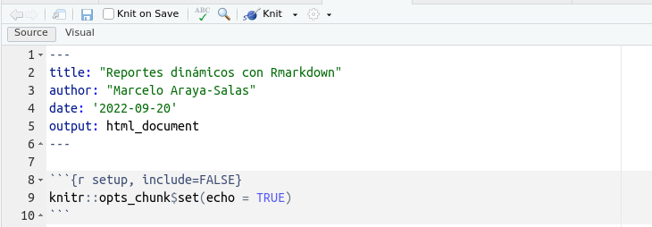
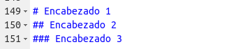
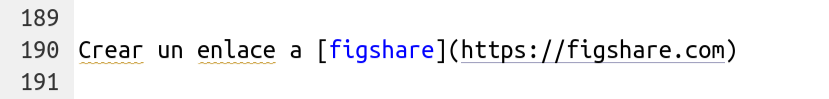
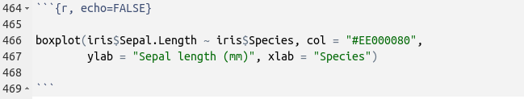

```{r, echo = FALSE, message=FALSE}

library(kableExtra)
library(knitr)
library(ggplot2)
library(viridis)

tibble <- function(x, ...) { 
  x <- kbl(x, digits=4, align= 'c', row.names = FALSE) 
   x <- kable_styling(x, position ="center", full_width = FALSE,  bootstrap_options = c("striped", "hover", "condensed", "responsive")) 
   asis_output(x)
}

registerS3method("knit_print", "data.frame", tibble)

# ggplot settings
geom_histogram <- function(...) ggplot2::geom_histogram(..., fill = viridis(10, alpha = 0.5)[8], show.legend = FALSE, bins = 20, color = "black")

geom_smooth <- function(...) ggplot2::geom_smooth(..., color = viridis(10,  alpha = 0.5)[8])

geom_boxplot <- function(...) ggplot2::geom_boxplot(..., fill = viridis(10, alpha = 0.5)[7])

theme_set(theme_classic(base_size = 20))

```

# Rmarkdown

R Markdown se describe [aquí](http://rmarkdown.rstudio.com/) como "*un formato de autoría que permite crear fácilmente documentos dinámicos, presentaciones e informes desde R*". Usando R Markdown, puedes generar documentos con piezas, o "bloques", de código R incrustado. Cuando el documento se renderiza, estos bloques se evalúan, y los resultados se anidan en el documento de acuerdo con las convenciones especificadas.

# ¿Por qué es útil?

Imagínese que le encargan generar un informe sobre la calidad del agua de cada uno de los 10 ríos. Puede:

* Producir figuras y tablas para cada río y luego pegar individualmente esos elementos en cada documento, *o  
* Usar R Markdown para generar 10 documentos con formato idéntico que incluyan cada uno las figuras y tablas correspondientes

Ahora imagine que se encuentra un error en el conjunto de datos, y todas sus figuras necesitan ser actualizadas. En lugar de actualizar y reemplazar cada figura individualmente, R Markdown permite simplemente volver a renderizar sus documentos utilizando el conjunto de datos corregido.

 Configuración de un nuevo documento R Markdown
(Como con todo lo relacionado con R), ¡recomiendo encarecidamente el uso de [R Studio](www.rstudio.com) para crear documentos R Markdown! Comience seleccionando `R Markdown...` en el menú desplegable que aparece al crear un nuevo archivo R:

```{r, echo=FALSE,out.width="70%"}

knitr::include_graphics("./images/image1.PNG")

```


**Nota:** Aquí se le pedirá que instale varios paquetes que son necesarios para que R Markdown funcione correctamente. 

Aparecerá una ventana que te pedirá que des un nombre y un autor a tu documento markdown, así como que especifiques el formato de salida de tu documento. Seleccione 'HTML' porque más tarde nos interesará convertirlo en una página web; puede cambiar sus preferencias de salida de HTML a 'PDF' o 'Word' en cualquier momento.

```{r, echo=FALSE, fig.height=4}
knitr::include_graphics("./images/image2.PNG")

```


Esto le llevará a su primer archivo .Rmd (o R Markdown). Verá que su nuevo archivo markdown ya tiene una plantilla con instrucciones básicas. Como queremos empezar de cero y crear nuestro propio documento, ¡sólo hay que borrar las líneas 8-23!

```{r, echo=FALSE, fig.height=3}


```

Si es un usuario habitual de R, estará familiarizado con el uso de `#` para denotar el texto que R no evaluará. En los documentos R Markdown, en lugar de decirle a R lo que *no* debe evaluar (usando `#`), le dices a R lo que *sí* evalúa (¡lo haremos un poco más tarde!).

_____

## Ejercicio 1
Cree un nuevo archivo R Markdown, escriba algunas líneas de texto, y haga clic en "Knit HTML" para ver cómo se verá su documento renderizado.  
```{r, echo=FALSE, fig.height=2}
knitr::include_graphics("./images/image4.PNG")

```

_____

# Formato con sintaxis Markdown 

Hay algunas grandes referencias en línea a R Markdown que tienen información sobre la sintaxis general de Markdown, incluyendo [esta guía simple](https://www.rstudio.com/wp-content/uploads/2015/02/rmarkdown-cheatsheet.pdf), y [esta guía más profunda](http://www.rstudio.com/wp-content/uploads/2015/03/rmarkdown-reference.pdf).

Todo este tutorial se ha creado usando R Markdown, así que incluiré capturas de pantalla del documento markdown en bruto para demostrar cómo funciona la sintaxis markdown. (¡Inicio de markdown...!)

_____

####Input:
```{r, echo=FALSE, fig.height=1}


```

####Salida:
Crear cabeceras de varios tamaños:  

#Cabecera 1 
##Cabecera 2  
##Cabecera 3

_____

####Input:
```{r, echo=FALSE, fig.height=1}
knitr::include_graphics("./images/image6.PNG")

```

####Salida:
Hacer que el texto sea **negrita**, *cursiva*, ~~ tachado~~, o super^script^.

_____

####Input:
```{r, echo=FALSE, fig.height=1}
knitr::include_graphics("./images/image7.PNG")

```

####Salida:
Añade una imagen:


_____

####Input:
```{r, echo=FALSE, fig.height=0.75}


```

####Salida:
Crear un enlace a [Google](https://www.google.com)

_____

##Ejercicio 2
Practica el formato utilizando la sintaxis de markdown configurando los encabezados, poniendo el texto en **negrita** y *cursiva*, incrustando una imagen y añadiendo un [enlace](https://www.r-bar.ca). Piensa en dónde debe guardarse tu imagen, y/o cómo definir la ruta de acceso a tu imagen para que R la localice e incruste correctamente.

_____

###Embedding Code
Para incrustar código R en su documento markdown, necesitará definir un área en la que el código R debe ser evaluado. Esto también se conoce como "chunk", y se define utilizando:

```{r, echo=FALSE, fig.height=1}
knitr::include_graphics("./images/image9.PNG")

```

Notarás que el chunk de R es de un gris más oscuro que los bloques de markdown por encima y por debajo de él. Todo lo que se incluye en el chunk se evalúa y se muestra de acuerdo con las especificaciones que usted puede modificar.

Comencemos creando un marco de datos que queramos analizar:

- sitio: 10 sitios, etiquetados de la a a la j
- visita: 2 visitas por sitio
- hábitat: 5 sitios oceánicos, 5 sitios fluviales
- riqueza: riqueza de especies en cada lugar, por visita

####Input:
```{r, echo=FALSE, fig.height=2}
knitr::include_graphics("./images/image10.PNG")

```

####Output:
```{r}
mydata<-data.frame(site=rep(letters[1:10],2),
                   visit=c(rep(1,10), rep(2,10)),
                  habitat=rep(c(rep("ocean",5),rep("river",5)),2),
                  richness=round(abs(rnorm(20,5,3)),0))
str(mydata) # Look at the structure of your dataframe
```

Cuando su documento se renderiza, el bloque de código se muestra en un cuadro gris, y los resultados de ese código se muestran en un cuadro blanco. ¿Y si sólo quieres que se muestre el resultado de tu código? ¿O que su código se muestre pero no se ejecute? Hay argumentos que puedes añadir a cada uno de tus bloques para especificar estas y otras opciones:

_____

Añade el argumento `echo=FALSE`.

####Input:
```{r, echo=FALSE, fig.height=2}
knitr::include_graphics("./images/image11.PNG")

```

####Output:

```{r, echo=FALSE}
mydata<-data.frame(site=rep(letters[1:10],2),
                   visit=c(rep(1,10), rep(2,10)),
                  habitat=rep(c(rep("ocean",5),rep("river",5)),2),
                  richness=round(abs(rnorm(20,5,3)),0))
str(mydata) # Look at the structure of your dataframe
```

Puedes ver que el código está oculto pero se muestran los resultados.

_____

[Esta referencia](https://www.rstudio.com/wp-content/uploads/2015/03/rmarkdown-reference.pdf) es una buena guía para 'opciones de bloque' como estos:
```{r, echo=FALSE, fig.height=4}
knitr::include_graphics("./images/image12.PNG")

```

____

 ##Ejercicio 3
Crea un marco de datos, y mira sus primeras filas (usando la función `head()`) y su estructura (usando la función `str()`). Intenta utilizar los argumentos `eval`, `include`, `collapse` y `echo` cuando configures tu chunk. ¿Cómo influyen en el documento renderizado?

_____

###Embedding Plots
Los gráficos pueden ser fácilmente incrustados en los documentos markdown simplemente utilizando las funciones de trazado disponibles en `{base}`, `{ggplot2}`, o `{lattice}` como lo haría en un típico script de R.

_____

####Input:
```{r, echo=FALSE, fig.height=1.5}


```

####Output:

```{r, echo=FALSE}
library(ggplot2)
ggplot(mydata)+
  geom_boxplot(aes(x=habitat, y=richness), fill="grey90")+
  theme_bw(15)+ylab("Species Richness")+xlab("Habitat Type")
```

_____

También puede utilizar los argumentos

- `dpi`: define los puntos por pulgada
- `fig.align`: alineación de la figura en el documento renderizado, puede ser `izquierda`, `derecha` o `centro`.
- `fig.height` y `fig.width`: definen el tamaño de la figura
- `fig.path`: ruta de archivo del directorio donde se debe guardar la figura


###Embedding R Code In-Line
Puede que hayas notado a lo largo de este tutorial que tengo pequeños bloques de texto que parecen `piezas de código`. Esto se conoce como incrustación de código en línea, y en realidad hay un par de maneras diferentes en que esto puede ser utilizado.

La primera es la más sencilla; simplemente queremos tomar un bloque de texto y darle la apariencia de un bloque de código. Esto es útil cuando estamos describiendo las funciones que hemos utilizado, como `str()` o cuando nos referimos en el texto a un objeto particular que existe en nuestro entorno R, como `mydata`. Es simplemente una forma de comunicar al lector que el texto debe ser interpretado en el contexto del código R. Es muy fácil hacer esto; sólo tienes que añadir ` a cada lado de tu texto, así:

_____

####Input: 
```{r, echo=FALSE, fig.height=0.5}
knitr::include_graphics("./images/image14.PNG")

```

####Salida:
El nombre de nuestro marco de datos es `mydata`.

_____

La segunda forma en que se utiliza esto es para evaluar el código R en línea, e incrustar los resultados de esa evaluación en el texto del documento renderizado. Por ejemplo, considere la frase "La riqueza media de especies encontrada en el sitio b fue *X*". La primera opción es calcular ese valor e introducir manualmente el resultado en la propia frase. ¿Pero qué pasa si el conjunto de datos cambia? Tendrá que volver a calcular ese valor y sustituirlo manualmente. Es mucho más eficiente utilizar código incrustado y evaluado en línea, como este:

_____

####Input:
```{r, echo=FALSE, fig.height=0.75}
knitr::include_graphics("./images/image15.PNG")

```

####Salida:
La riqueza media de especies encontrada en el sitio b fue `r mean(mydata$richness[mydata$site=="b"])`.

(Recuerde que los valores de riqueza se generan aleatoriamente cuando se crea el conjunto de datos, por lo que su valor puede ser diferente a éste).

____


# References

- [R Markdown: The Definitive Guide](https://bookdown.org/yihui/rmarkdown/)


&nbsp; 

---

&nbsp; 
 
<font size="4">Session information</font>

```{r session info, echo=F}

sessionInfo()

```

