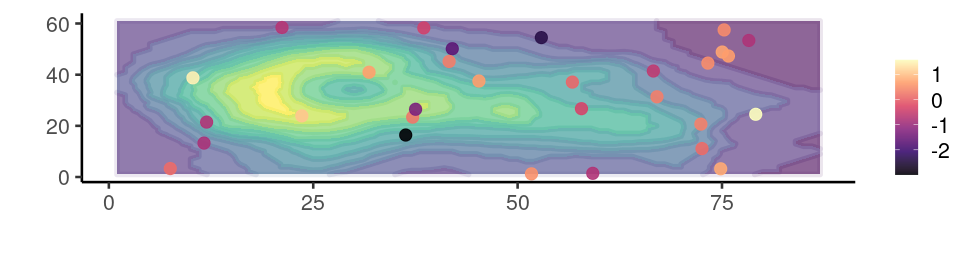

<br>

<center>
<font size="6"><b>Programación y métodos estadísticos avanzados en R</b></font>
</center>

<center><font size="5"><b><a href="https://www.ucr.ac.cr/">Universidad de Costa Rica</a><br></b></font></center>

<i><center><font size="4.5"><b><a href="marceloarayasalas.weebly.com/">Marcelo Araya-Salas PhD</a> y <a href="https://scholar.google.com/citations?user=hTu_SnkAAAAJ&hl=es&oi=ao"> Mario Espinoza PhD</a><br></b></font></center></i>

<!-- <center></center> -->

```{r, out.width = "70%", echo = FALSE, fig.align= "center"}

# knitr::include_graphics("./images/3d_prob.jpeg")
# 

```

&nbsp; 

Este curso pretende profundizar en los elementos de programación computacional,
manipulación de bases de datos, diseño experimental, graficación personalizada, y el uso de
técnicas y modelaje estadístico avanzadas utilizando R como plataforma. El curso está dirigido a estudiantes avanzados de carrera, de licenciatura o postgrado. En el curso se pretende cubrir las bases de los principales análisis y técnicas de modelaje estadístico, así como análisis emergentes. Todas las semanas se realizarán prácticas de laboratorio en donde se aplicarán los conceptos desarrollados durante las clases de teoría. Además, durante el curso cada estudiante presentará un paquete o extensión (conjunto de herramientas aplicables a análisis específicos) de R, en donde profundizará sobre sus aplicaciones en el campo de la biología demostrando en clase en que consiste el análisis.

&nbsp;

<div class="alert alert-info">

### **Objetivos**

&nbsp;

- Familiarizar al estudiante con la programación en R
- Brindar herramientas para la manipulación de bases de datos
- Emplear métodos de visualización de datos
- Cubrir algunos de los análisis estadísticos tradicionales
- Proveer a los estudiantes con experiencia en la aplicación de las herramientas
brindadas por medio de prácticas y proyectos de investigación

</div>

&nbsp;    

<div class="alert alert-warning">


**Consejos para garantizar el máximo aprovechamiento del curso**

&nbsp; 

  - Aseguráte de tener todo lo que necesitas antes del comienzo de la clase
  - Tratá de estar preparado unos minutos antes del comienzo de la clase
  - Intenta concentrarte al máximo en el curso, cierra otros programas o pestañas innecesarias del navegador de internet (por ejemplo, instagram, twitter, etc)
  - Comentá el código


</div>
