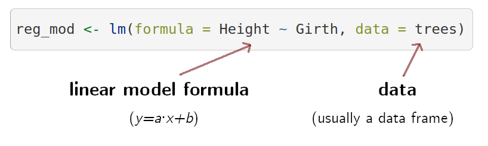

```{r, echo = FALSE, message=FALSE}

library(kableExtra)
library(knitr)
library(ggplot2)
library(viridis)
library(lmerTest)
library(sjPlot)

tibble <- function(x, ...) { 
  x <- kbl(x, digits=4, align= 'c', row.names = FALSE) 
   x <- kable_styling(x, position ="center", full_width = FALSE,  bootstrap_options = c("striped", "hover", "condensed", "responsive")) 
   asis_output(x)
}

registerS3method("knit_print", "data.frame", tibble)

# ggplot settings
geom_histogram <- function(...) ggplot2::geom_histogram(..., fill = viridis(10, alpha = 0.5)[8], show.legend = FALSE, bins = 20, color = "black")

geom_smooth <- function(...) ggplot2::geom_smooth(..., color = viridis(10,  alpha = 0.5)[8])

geom_boxplot <- function(...) ggplot2::geom_boxplot(..., fill = viridis(10, alpha = 0.5)[7])

geom_pointrange <- function(...) ggplot2::geom_pointrange(..., show.legend = FALSE, color = viridis(10, alpha = 0.5)[7], size = 2) 

plot_model <- function(...) sjPlot::plot_model(xy_mod, type = "diag", colors = viridis(10, alpha = 0.5)[7])

theme_set(theme_classic(base_size = 20))

```


<style>
body
  { counter-reset: source-line 0; }
pre.numberSource code
  { counter-reset: none; }
</style>

```{r setup, include = FALSE}


knitr::opts_chunk$set(
  class.source = "numberLines lineAnchors", # for code line numbers
  tidy.opts = list(width.cutoff = 65), 
  tidy = TRUE,
  message = FALSE
 )

```

```{r klippy, echo=FALSE, include=TRUE}

# remotes::install_github("rlesur/klippy")

# to add copy button
klippy::klippy(position = c('top', 'right'))
```

&nbsp; 

# Linear models as a unifying framework

Traditionally, statistical models have been taught as disconnected tools with no clear relationship between them. Take a look at a classic biology stats book (Sokal & Rolhf):

```{r, out.width = "100%", echo = FALSE, fig.align= "center"}

knitr::include_graphics("./images/sokal_rohlf.png")

```
&nbsp; 

However, most of those common statistical models are just special cases of linear models. Hence, learning them as such can largely simplify things. This approach has several advantages: 

- First of all, **it all comes down to *y=a⋅x+b***, which largely simplify learning

- This also means that there is **no need to learn about parameters, assumptions, and result interpretation for every single special case**

- Linear models have been extended to **account for complex distributions and data structures** (e.g. mixed models, generalized linear models, zero-inflated models, etc) providing a **more flexible platform**. 

- Linear models are **applied across statistical paradigms** (e.g. frequentist, bayesian)

&nbsp;

<div class="alert alert-info">

# Purpose

&nbsp;

- Understand statistical inference through a single modelling tool (broad sense linear models)

- Get familiar with building linear models
 
- Extent linear models to different data structures

</div>

&nbsp; 

<div class="alert alert-warning">

# Workshop overview

- [How to simulate data](#how-to-simulate-data) 

- [How to use simulated data to understand the behavior of statistical tools](#how-to-use-simulated-data-to-understand-the-behavior-of-statistical-tools)

- [Linear regression basic structure (in R)](#linear-regression-in-r)

- [Use simulated data to understand linear models](#use-simulated-data-to-understand-linear-models)

- [Common statistical tests as special cases of linear regression](#common-statistical-tests-as-special-cases-of-linear-regression)

- [Extending the linear models to more complex data structures](#extending-the-linear-models-to-more-complex-data-structures)

- [Additional resources](#additional-resources)

</div>

&nbsp;

## A few tips

- Feel free to ask questions at any time

- Try to run the code yourself (if you don't have much experience in R try to sit with someone that does)

- The line of the code blocks are numbered so we can refer to specific part of the code, and the code can be copied with the button on the upper right corner of the box:

```{r, out.width = "100%", echo = FALSE, fig.align= "center"}

knitr::include_graphics("./images/chunk.png")

```
&nbsp; 

--- 

Please load the following packages:
```{r, eval = FALSE}

library(ggplot2)
library(viridis)
library(lmerTest)
library(sjPlot)

```

---

# How to simulate data

## Generating random numbers in R


Statistics allow us to infer patterns in the data. We tend to use real data sets to teach stats. However, it might get circular to understand the inner working of an statistical tool by testing its ability to infer a pattern that we are not sure its found in the data (and have no idea on the mechanism producing that pattern). **Simulations allow us to create controlled scenarios in which we know for sure the patterns** present in the data and the underlying processes that generated them.

R offers some basic functions for data simulation. The most used ones are the random number generating functions. The names of these functions all start with *r* (`r____()`). For instance `runif()`:
```{r, echo=FALSE}
set.seed(7)
```


```{r}

unif_var <- runif(n = 100, min = 0, max = 10)

```
&nbsp; 

The output is a numeric vector of length 1 thousand (`n = 100`):

```{r}

unif_var

```


We can explore the output by plotting a histogram:

```{r}

# create histogram
ggplot(data = data.frame(unif_var), mapping = aes(x = unif_var)) + geom_histogram() 

```
&nbsp; 

It shows a uniform distribution ranging from 0 to 10. 

We can also simulate random numbers coming from a normal distribution using `rnorm()`:

```{r}

# create random variable
norm_var <- rnorm(n = 1000, mean = 2, sd = 1)

# plot histogram
ggplot(data = data.frame(norm_var), mapping = aes(x = norm_var)) + geom_histogram() 

```

&nbsp; 

Note that random number generating functions all have the argument 'n', which sets the length of the output vector (i.e. number of random numbers), plus some additional arguments related to specific parameters of the distribution.

Continuous variables (i.e. numeric vectors) can be converted to discrete variables (i.e. integer numbers) simply by rounding them:

```{r}

v1 <- rnorm(n = 5, mean = 10, sd = 3)

v1

round(x = v1, digits = 0)

```
&nbsp; 

<div class="alert alert-info">

<font size="5">Exercise</font> 

- What do the functions `rbinom()` and `rexp()` do? (tip: run `?rexp`)

- Run them and make histograms of their output
 
- What do the arguments 'mean' and 'sd' in `rnorm()` do? Play with different values and check the histogram to get a sense of their effect in the simulation

</div>

&nbsp; 

## Generating categorical variables

The easiest way to generate categorical variables is to use the 'letters' (or 'LETTERS') example vector to assign category levels. We can do this using the function `rep()`. For instance, the following code creates a categorical (character) vector with two levels, each one with 4 observations:

```{r}

rep(letters[1:2], each = 4)

```
&nbsp; 

We can also replicate this pattern using the argument 'times'. This code replicates the previous vector 2 times:

```{r}

rep(letters[1:2], each = 4, times = 2)

```
&nbsp; 

Another option is to simulate a variable from a binomial distribution and then convert it into a factor:

```{r}
# run rbinom
binom_var <- rbinom(n = 50, size = 1, prob = 0.5)

binom_var
```


```{r}
categ_var <- factor(binom_var, labels = c("a", "b"))

categ_var
```
&nbsp; 

## Random sampling

The other important R tool for playing with simulated data is `sample()`. This function allows you to take samples of specific sizes from vectors. For instance, take the example vector `letters`:

```{r}

letters

```
&nbsp; 

We can take a sample of this vector like is:

```{r}

sample(x = letters, size = 10)

```
&nbsp; 

The argument 'size'  allow us to determine the size of the sample. Note that we get an error if the size is larger than the vector itself:

```{r, error=TRUE}

sample(x = letters, size = 30)

```
&nbsp; 

This can only be done when sampling with replacement. Sampling with replacement can be applied by setting the argument `replace = TRUE`:

```{r}

sample(x = letters, size = 30, replace = TRUE)

```
&nbsp; 

## Iterating a process

Often simulations most be repeated several times to rule out spurious results due to chance or just to try different parameters. The functions for simulating data mentioned above can be run several times (e.g. iterated) using the function `replicate()`:

```{r}

repl_rnorm <- replicate(n = 3, expr = rnorm(2), simplify = FALSE)

class(repl_rnorm)

repl_rnorm
```
&nbsp; 

## Making simulations reproducible

The last trick we need to run simulations in R is the ability to reproduce a simulation (i.e. get the exact same simulated data and results). This can be useful for allowing other researchers to run our analyses in the exact same way. This can be easily done with the function `set.seed()`. Try running the following code. You should get the same output:

```{r}

set.seed(10)

runif(n = 2)

```

---


# Creating data sets
    
## Datasets with numeric and categorical data

Now that we know how to simulate continuous and categorical variable. We can put them together to create simulated data sets. This can be done using the function `data.frame()`:

```{r}

# create categorical variable
group <- rep(letters[1:2], each = 3)

# create continous data
size <- rnorm(n = 6, mean = 5, sd = 1)

# put them together in a data frame
df <- data.frame(group, size)

# print
df

```

Of course, we could add more variables to this data frame:

```{r}


# create categorical variable
group <- rep(letters[1:2], each = 3)
individual <- rep(LETTERS[1:6])

# create continous data
size <- rnorm(n = 6, mean = 5, sd = 1)
weight <- rnorm(n = 6, mean = 100, sd = 10)


# put them together in a data frame
df <- data.frame(group, individual, size, weight)

# print
df

```

And that's a simulated data set in its most basic form. That looks a lot like the kind of data we use to work with in the biological science.

---

# How to use simulated data to understand the behavior of statistical tools

## A proof of concept: *the Central Limit Theorem*

The [Central Limit Theorem](https://en.wikipedia.org/wiki/Central_limit_theorem) states that, if we take repeated random samples of a population, the means of those samples will conform to a normal distribution, even if the population is not normally distributed. In addition, the resulting normal distribution must have a mean close to the population's mean. The theorem is a key concept for inferential statistics as it implies that statistical methods that work for normal distributions can be applicable to many problems involving other types of distributions. Nonetheless, the point here is only to showcase how simulations can be used to understand the behavior statistical methods.  

To check if those basic claims about the Central Limit Theorem hold true we can use simulated data in R. Let's simulate a 1000 observation population with a uniform distribution: 

```{r, eval=FALSE}
# simulate uniform population
unif_pop <- runif(1000, min = 0, max = 10)

# check distribution/ plot histogram
ggplot(data = data.frame(unif_pop), mapping = aes(x = unif_pop)) + geom_histogram() 

```

```{r, echo=FALSE}
set.seed(10)

# simulate uniform population
unif_pop <- runif(1000, min = 0, max = 10)

# check distribution/ plot histogram
ggplot(data = data.frame(unif_pop), mapping = aes(x = unif_pop)) + geom_histogram() 


```

&nbsp; 

We can take random samples using `sample()` like this:

```{r}

sample(x = unif_pop, size = 30)

```
&nbsp; 
 
This process can be replicated several times with `replicate()`: 

```{r}

samples <- replicate(n = 100, expr = mean(sample(x = unif_pop, size = 30)))

```
&nbsp; 

The code above takes 100 samples with 30 values each. We can now check the distribution of the samples: 

```{r, eval=FALSE}

# check distribution/ plot histogram
ggplot(data = data.frame(samples), mapping = aes(x = samples)) + geom_histogram() 


```

```{r, echo=FALSE}

# check distribution/ plot histogram
ggplot(data = data.frame(samples), mapping = aes(x = samples)) + geom_histogram() 

```
&nbsp; 

... as well as the mean:

```{r}

mean(samples)

```
&nbsp; 

As expected, the samples follows a normal distribution with a mean close to the mean of the population, which is:

```{r}

mean(unif_pop)

```
&nbsp;

Let's try with a more complex distribution. For instance,  a bimodal distribution:

```{r, eval=FALSE}

# set seed
set.seed(123)

# simulate variables
norm1 <- rnorm(n = 1000, mean = 10, sd = 3)
norm2 <- rnorm(n = 1000, mean = 20, sd = 3)

# add them in a single one
bimod_pop <- c(norm1, norm2)

# check distribution/ plot histogram
ggplot(data = data.frame(bimod_pop), mapping = aes(x = bimod_pop)) + geom_histogram() 

```

```{r, echo=FALSE}

# set seed
set.seed(123)

norm1 <- rnorm(n = 1000, mean = 10, sd = 3)
norm2 <- rnorm(n = 1000, mean = 20, sd = 3)

bimod_pop <- c(norm1, norm2)

# check distribution/ plot histogram
ggplot(data = data.frame(bimod_pop), mapping = aes(x = bimod_pop)) + geom_histogram() 
```

```{r, eval=FALSE}

samples <- replicate(200, mean(sample(bimod_pop, 10)))

# check distribution/ plot histogram
ggplot(data = data.frame(samples), mapping = aes(x = samples)) + geom_histogram() 

```

```{r, echo=FALSE}

samples <- replicate(200, mean(sample(bimod_pop, 10)))

# check distribution/ plot histogram
ggplot(data = data.frame(samples), mapping = aes(x = samples)) + geom_histogram() 

```


```{r}
mean(samples)

mean(bimod_pop)
```
&nbsp;

<div class="alert alert-info">

<font size="5">Exercise</font> 

&nbsp;

- Try exploring the Central Limit Theorem as above but this time using:
    
    1. An exponential distribution (`rexp()`) 
    1. A binomial distribution (`rbinom()`) 

&nbsp;

- For each distribution: plot a histogram and compare the means of the population and the samples

</div>

&nbsp; 

---

<div class="alert alert-warning">

<font size = 6><center>Simple linear regression</center></font>

Linear regressions are based on the linear equation *a = mx + b* we learned in high school. The formal representation looks like this:

<center><font size = 6>$\hat{Y} \sim \beta_{o} + \beta_{1} * x_{1}$</font></center>

&nbsp; 

- $\hat{Y}$: response variable

- $\beta_{o}$: intercept (y value)

- $\beta_{1}$: estimate of the magnitude of the effect of $x_{1}$ on $\hat{Y}$ (a.k.a. effect size, coefficient or simply the 'estimate')

- $x_{1}$: predictor variable

&nbsp; 

The most common goal of a linear regression is estimating the $\beta_{*}$ values. This is achieved by finding the best fitting straight line representing the association between a predictor and the response:

```{r, out.width = "100%", echo = FALSE, fig.align= "center"}

knitr::include_graphics("./images/regression.jpg")

```
&nbsp; 

Those $\beta_{*}$s are the estimated effect size of the correspondent predictor (e.g. $\beta_{1}$ is the effect size $x_{1}$). Their value represent the mean change in $\hat{Y}$ (in $\hat{Y}$ units) for a unit of change in $\beta_{*}$.  Hence the null hypothesis is that those $\beta_{*}$s are not different from 0:

<center><font size = 6>$\qquad \mathcal{H}_0: \hat{Y} = \beta_0 + 0 * x_{1}$</font></center>

which is equivalent to this:

<center><font size = 6>$\qquad \mathcal{H}_0: \hat{Y} = \beta_0$</font></center>

&nbsp; 

```{r, echo = FALSE, eval = FALSE}

For instance, a regression model with this output:

set.seed(123)

# number of observations
n <- 50
b0 <- 1
b1 <- 3
error <- rnorm(n = n, sd = 2)

# random variables
B1 <- rnorm(n = n)
y <- b0 + b1 * B1 + error

# create data frame
xy_data <- data.frame(B1, y)

# build model
xy_mod <- lm(formula = y ~ B1, data = xy_data)

summary(xy_mod)$coefficients

Results in the following predictive model:

<center><font size = 6>$\hat{Y} \sim 1.079 + 2.926 * x_{1}$</font></center>

```

```{r, out.width = "100%", echo = FALSE, fig.align= "center"}

knitr::include_graphics("./images/model_betas.png")

```
&nbsp; 

</div>

&nbsp; 

--- 

# Linear regression in R

To take full advantage of linear models we need to feel comfortable with them. We will do this by exploring R's linear regression function `lm()`. In R most linear models and their extensions share common data input and output formats which makes easy to apply them once we understand their basics. 

We will use the data set 'trees' that comes by default with R. 'trees' provides measurements of the **diameter** (labeled as 'Girth'), **height** and **volume** of 31 felled black cherry trees: 

```{r}

head(trees)

```
&nbsp;

The basic R function to build a linear model is `lm()`. Let's look at the basic components of a regression model using `lm()`:


```{r, out.width = "100%", echo = FALSE, fig.align= "center"}



```
&nbsp; 

We can fit this model to look at the output:
```{r}

reg_mod <- lm(formula = Height ~ Girth, data = trees)

summary(reg_mod)

```
&nbsp; 

This is what the elements of the output mean:

- **Call**: the function and parameters were used to create the model

- **Residuals**: distribution of the residuals. Residuals are the difference between what the model predicted and the actual value of y. This is a graphic representation of the residuals:

```{r, echo = FALSE}

# add predicted values for plotting
trees$predicted <- reg_mod$fitted.values

# plot
ggplot(trees, aes(x = Girth, y = Height)) + 
  geom_smooth(method = "lm", se = FALSE) +  
  geom_segment(aes(xend = Girth, yend = predicted), alpha = .2) +
  geom_point()

```
&nbsp; 

- **Coefficients**: this one contains the effect sizes ('Estimates'), a measure of their uncertainty ('Std. Error'), the associated statistic ('t value') and p value ('Pr(>|t|)'). Estimates are given as the mean change in y for every increase in 1 unit in x. So for this example is 1.0544 $in / in$. Despite the fact that the units will cancel out (`1.0544 $in / in$ = 1.0544) keeping them in mind is still biologically meaningful. They mean that, in average, and 1 inch increase in girth you will expect an increase of 1.0544 inches in height. 

- **Residual standard error**: self-explanatory. The standard error of the residuals

- **Multiple R-squared**: the coefficient of determination, this is intended as a measurement of how well your model fits to the data

- **Adjusted R-Squared**: similar to the 'Multiple R-squared' but penalized for the number of parameters

- **F-statistic**: statistic for a global test that checks if at least one of your coefficients are non-zero

- **p-value**: probability for a global test that checks if at least one of your coefficients are non-zero

&nbsp; 

We will use `lm()` to showcase the flexibility of regression models. Regression components will be added gradually so we can take time of understand each of them as well as the correspondent changes in the regression output.

---

## Response (intercept)-only model

Let's first create a response numeric variable:

```{r}

# set seed
set.seed(123)

# number of observations
n <- 50

# random variables
y <- rnorm(n = n, mean = 0, sd = 1)

# put it in a data frame
y_data <- data.frame(y)
```
&nbsp;

This single variable can be input in an **intercept-only regression model**. To do this we need to supply the model formula and the data to `lm()`:

```{r}

# run model
y_mod <- lm(formula = y ~ 1, data = y_data)

```
&nbsp;

Which is equivalent to:

<center><font size = 6>$\hat{Y} \sim \beta_{o}$</font></center>

&nbsp; 

We can get the default summary of the model results by running `summary()` on the output object 'y_mod':

```{r}

summary(y_mod)

```
&nbsp; 

It can be quite informative to plot the effect sizes (although in this case we just have one):
```{r}

ci_df <- data.frame(param = names(y_mod$coefficients), 
                    est = y_mod$coefficients, confint(y_mod))

ggplot(ci_df, aes(x=param, y=est)) + 
  geom_hline(yintercept = 0, color="red", lty = 2) +
  geom_pointrange(aes(ymin = X2.5.., ymax = X97.5..)) + 
  labs(x = "Parameter", y = "Effect size") + 
  coord_flip()

```
&nbsp;

<div class="alert alert-success">

&nbsp; 

<center><font size="5"><b>Model interpretation</b></font></center>

&nbsp; 

For assessing the significance of the association we focus on the coefficients table:

```{r, echo= FALSE}

summ_y_mod <- summary(y_mod)

summ_y_mod$coefficients
```

- In this example there are no predictors in the model so we only got an estimate for the intercept ($\beta_0$)

- The model tell us that the intercept is estimated at `r summ_y_mod$coefficients[1, 1]` and that this value is not significantly different from 0 (p-value = `r summ_y_mod$coefficients[1, 4]`)

- In this case the intercept is simply the mean of the response variable

```{r}

mean(y_data$y)

```
&nbsp; 

- We seldom have predictions about the intercept so we tend to ignore this estimate.

</div>

&nbsp;

<div class="alert alert-info">

<font size="5">Exercise</font> 

&nbsp;

- Change the `mean` argument in the `rnorm()` function call ([line 105](#cb53-8)) to a value other than 0 and look at how things change in the coefficients table 

- Change the `sd` argument in the `rnorm()` function call ([line 105](#cb53-8)) to a higher value and look at how things change in the coefficients table 

</div>

&nbsp; 

---

## Adding a non-associated response variable

We can create 2 unrelated numeric variables like this:

```{r}

# set seed
set.seed(123)

# number of observations
n <- 50

# random variables
y <- rnorm(n = n)
x1 <- rnorm(n = n)

# create data frame
xy_data <- data.frame(x1, y)

```
&nbsp;

These two variables can be input in a regression model to evaluate the association between them:

```{r}

# build model
xy_mod <- lm(formula = y ~ x1, data = xy_data)

# plot
ggplot(xy_data, aes(x = x1, y = y)) + 
  geom_smooth(method = "lm", se = FALSE) + 
  geom_point() # plot points


```
&nbsp;

Which is equivalent to:

<center><font size = 6>$\hat{Y} \sim \beta_{o} + \beta_{1} * x_{1}$</font></center>

&nbsp; 

Let's print the summary for this model:

```{r}

summary(xy_mod)

```
&nbsp; 

... and plot the effect sizes:
```{r}

ci_df <- data.frame(param = names(xy_mod$coefficients), 
                    est = xy_mod$coefficients, confint(xy_mod))

ggplot(ci_df, aes(x=param, y=est)) + 
  geom_hline(yintercept = 0, color="red", lty = 2) +
  geom_pointrange(aes(ymin = X2.5.., ymax = X97.5..)) + 
  labs(x = "Parameter", y = "Effect size") + 
  coord_flip()

```
&nbsp;

We should 'diagnose' the adequacy of the model by inspecting more closely the distribution of residuals.The function `plot_model()` from the package 'sjPlot' does a good job for creating diagnostic plots for linear models:

```{r, out.width= "80%", fig.height=4}

plot_model(xy_mod, type = "diag")

```
&nbsp;

<div class="alert alert-success">

&nbsp; 

<center><font size="5"><b>Model interpretation</b></font></center>

&nbsp; 

Coefficients table:

```{r, echo= FALSE}

summ_xy_mod <- summary(xy_mod)

summ_xy_mod$coefficients
```
&nbsp; 

- In this example we added one predictor to the model so we got an additional estimate (and extra row, 'x1')

- The model tell us that the estimate of 'x1' is `r summ_xy_mod$coefficients[1, 1]` and that it is not significantly different from 0 (p-value = `r summ_xy_mod$coefficients[2, 4]`)

</div>

---

&nbsp; 

## Simulating an associated predictor

We can use the linear model formula above to simulate two associated continuous variables like this:

```{r}

# set seed
set.seed(123)

# number of observations
n <- 50
b0 <- -4
b1 <- 3
error <- rnorm(n = n, sd = 3)

# random variables
x1 <- rnorm(n = n)
y <- b0 + b1 * x1 + error

# create data frame
xy_data2 <- data.frame(x1, y)

```
&nbsp;

Note that **we also added an error term**, so the association is not perfect. Let's run the model and plot the association between the two variables:

```{r}

# build model
xy_mod2 <- lm(formula = y ~ x1, data = xy_data2)

# plot
ggplot(xy_data2, aes(x = x1, y = y)) + 
  geom_smooth(method = "lm", se = FALSE) +  
  geom_point() # plot points

```
&nbsp;

The formula is the same than the previous model:

<center><font size = 6>$\hat{Y} \sim \beta_{o} + \beta_{1} * x_{1}$</font></center>

&nbsp; 

This is the summary of the model:
```{r}

summary(xy_mod2)

```
&nbsp;


.. the effect size plot:
```{r}

ci_df <- data.frame(param = names(xy_mod2$coefficients), 
                    est = xy_mod2$coefficients, confint(xy_mod2))

ggplot(ci_df, aes(x=param, y=est)) + 
  geom_hline(yintercept = 0, color="red", lty = 2) +
  geom_pointrange(aes(ymin = X2.5.., ymax = X97.5..)) + 
  labs(x = "Parameter", y = "Effect size") + 
  coord_flip()

```
&nbsp;

... and the model diagnostic plots:
```{r, out.width= "80%", fig.height=4}

plot_model(xy_mod2, type = "diag")

```
&nbsp;


<div class="alert alert-success">

&nbsp; 

<center><font size="5"><b>Model interpretation</b></font></center>

&nbsp; 

Coefficients table:

```{r, echo= FALSE}

summ_xy_mod2 <- summary(xy_mod2)

summ_xy_mod2$coefficients
```

- The model tells us that $\beta_1$ (the effect size of 'x1') is `r summ_xy_mod2$coefficients[2, 1]` and that it is significantly different from 0 (p-value = `r summ_xy_mod2$coefficients[2, 4]`)

- The simulated values for the regression parameters can be compared to the summary of the `lm()` model to get a sense of the model precision:

    - $\beta_1$ (the effect size of 'x1') was set to `r b1` and was estimated as `r round(summ_xy_mod2$coefficients[2, 1], 3)` by the model  

</div>

&nbsp;

<div class="alert alert-info">

<font size="5">Exercise</font> 

&nbsp;

- Increase the sample size (`n`) to 1000 or higher

- How did the effect size ($\beta$) estimates change? 

- How did the standard error of the effect size change?

- Now change `n` to 15 and check again the model estimates (this time check the p-value as well)

</div>

&nbsp; 

---

## Adding more than 1 predictor: multiple regression

Multiple linear regression is an extension of the simple linear regression model that can take several predictors:

<center><font size = 6>$\hat{Y} \sim \beta_{o} + \beta_{1} * x_{1} + \cdots + \beta_{n} * x_{n}$</font></center>

&nbsp;

The formula looks a bit busy, but it only means that any additional parameter will have its own estimate ($\beta$). The formula for a two-predictor linear regression looks like this:

<center><font size = 6>$\hat{Y} \sim \beta_{o} + \beta_{1} * x_{1} + \beta_{2} * x_{2}$</font></center>

&nbsp;

.. and it can be simulated like this:
```{r}

# set seed
set.seed(123)

# number of observations
n <- 50
b0 <- -4
b1 <- 3
b2 <- -2
error <- rnorm(n = n, mean = 0, sd = 3)

# random variables
x1 <- rnorm(n = n)
x2 <- rnorm(n = n)
y <- b0 + b1 * x1 + b2 * x2 + error

# create data frame
xy_data_multp <- data.frame(x1, x2, y)

# build model
xy_mod_multp <- lm(formula = y ~ x1 + x2, data = xy_data_multp)

summary(xy_mod_multp)

```
&nbsp;

... plot the effect sizes:
```{r}

ci_df <- data.frame(param = names(xy_mod_multp$coefficients), 
                    est = xy_mod_multp$coefficients, confint(xy_mod_multp))

ggplot(ci_df, aes(x=param, y=est)) + 
  geom_hline(yintercept = 0, color="red", lty = 2) +
  geom_pointrange(aes(ymin = X2.5.., ymax = X97.5..)) + 
  labs(x = "Parameter", y = "Effect size") + 
  coord_flip()

```
&nbsp;

... and the model diagnostic plots:
```{r, out.width= "80%", fig.height=4}

plot_model(xy_mod_multp, type = "diag")

```
&nbsp;

<div class="alert alert-success">

&nbsp; 

<center><font size="5"><b>Model interpretation</b></font></center>

&nbsp; 

Coefficients table:

```{r, echo= FALSE}

summ_xy_mod_multp <- summary(xy_mod_multp)

summ_xy_mod_multp$coefficients
```

- The model found that $\beta_1$ (the effect size of 'x1') is `r summ_xy_mod_multp$coefficients[2, 1]` and that it is significantly different from 0 (p-value = `r summ_xy_mod_multp$coefficients[2, 4]`)

- It also found that the $\beta_2$ (the effect size of 'x2') is `r summ_xy_mod_multp$coefficients[3, 1]` and that it is also significantly different from 0 (p-value = `r summ_xy_mod_multp$coefficients[3, 4]`)

- The simulated values for the regression parameters can be compared to the summary of the `lm()` model to get a sense of the model precision:

    - $\beta_1$ was set to `r b1` and was estimated as `r round(summ_xy_mod_multp$coefficients[2, 1], 3)`

    - $\beta_2$ (the effect size of 'x2') was set to `r b2` and was estimated as `r round(summ_xy_mod_multp$coefficients[3, 1], 3)`

</div>

&nbsp;

<div class="alert alert-info">

<font size="5">Exercise</font> 

&nbsp;

- Set one of the effect sizes ($\beta$) to 0 (or very close to 0) and run again the model and its summary

- How did the p-value change?

- Simulate a scenario with two predictors in which only one of them is associated with the response

</div>

&nbsp; 


There is an important point to stress here: **Multiple regression estimate the effect of a predictor after accounting for the effect of the other predictors in the model**. In other words, new predictors in the model will attempt to explain variation in the data that was not explained by the other predictors. So **the result of the multiple regression is not equivalent to the results of simple linear regressions** on the same predictors. This can be easily shown by running those regressions:

```{r}

# build models
x1y_mod <- lm(formula = y ~ x1, data = xy_data)
x2y_mod <- lm(formula = y ~ x2, data = xy_data)

# shortcut to coefficients
coef(xy_mod)
coef(x1y_mod)
coef(x2y_mod)

```
&nbsp;

The estimates for the same variables vary considerably between the multiple regression and the single predictor regressions.

This point is further demonstrated by the fact that, if one of the predictors has no influence at all on the response, the effect of the additional predictor will converge to its effect in a simple linear regression. To simulate this scenario we set b2 to 0:

```{r}

# set seed
set.seed(123)

# number of observations
n <- 50
b0 <- -4
b1 <- 3
b2 <- 0
error <- rnorm(n = n, mean = 0, sd = 1)

# random variables
x1 <- rnorm(n = n)
x2 <- rnorm(n = n)
y <- b0 + b1 * x1 + b2 * x2 + error

# create data frame
xy_data <- data.frame(x1, x2, y)

# build model
xy_mod <- lm(formula = y ~ x1 + x2, data = xy_data)
x1y_mod <- lm(formula = y ~ x1, data = xy_data)

# shortcut to coefficients
coef(xy_mod)
coef(x1y_mod)
```

The estimate for $\beta_1$ was almost the same in the multiple regression (`r coef(xy_mod)[2]`) and the single predictor regression (`r coef(x1y_mod)[2]`)

For convenience we used `coef()` to extract only the estimates from the regression, but the values are the same we get with `summary(model)`.


---

## Having a categorical predictor

For categorical predictors we can first create a binary (0, 1) variable and then add labels to each value:

```{r}

# set seed
set.seed(13)

# number of observations
n <- 50
b0 <- -3
b1 <- 2
error <- rnorm(n = n, mean = 0, sd = 3)

# random variables
x1_num <- sample(0:1, size = n, replace = TRUE)
y <- b0 + b1 * x1_num + error

x1 <- factor(x1_num, labels = c("a", "b"))

# create data frame
xy_data_cat <- data.frame(x1, x1_num, y)

head(xy_data_cat)

```
&nbsp;

And this is how it is formally written:

<center><font size = 6>$\hat{Y} \sim \beta_{o} + \beta_{1} * x_{1}$</font></center>

&nbsp;

Same thing as with continuous predictors. 

We can explore the pattern in the data using a boxplot:

```{r}

# plot
ggplot(xy_data_cat, aes(x = x1, y = y)) + 
  geom_boxplot()

```
&nbsp;

... and get the estimates of the model:
```{r}

# build model
xy_mod_cat <- lm(formula = y ~ x1, data = xy_data_cat)

summary(xy_mod_cat)
```
&nbsp;

... plot the effect sizes:
```{r}

ci_df <- data.frame(param = names(xy_mod_cat$coefficients), 
                    est = xy_mod_cat$coefficients, confint(xy_mod_cat))

ggplot(ci_df, aes(x=param, y=est)) + 
  geom_hline(yintercept = 0, color="red", lty = 2) +
  geom_pointrange(aes(ymin = X2.5.., ymax = X97.5..)) + 
  labs(x = "Parameter", y = "Effect size") + 
  coord_flip()

```
&nbsp;

... and the model diagnostic plots:
```{r, out.width= "80%", fig.height=4}

plot_model(xy_mod_cat, type = "diag")[[2]]

```
&nbsp;

<div class="alert alert-success">

&nbsp; 

<center><font size="5"><b>Model interpretation</b></font></center>

&nbsp; 

Coefficients table:

```{r, echo= FALSE}

summ_xy_mod_cat <- summary(xy_mod_cat)

summ_xy_mod_cat$coefficients
```

- The model found that $\beta_1$ (the effect size of 'x1') is `r summ_xy_mod_cat$coefficients[2, 1]` and that it is significantly different from 0 (p-value = `r summ_xy_mod_cat$coefficients[2, 4]`)

- The simulated values for the regression parameters can be compared to the summary of the `lm()` model to get a sense of the model precision:

    - $\beta_1$ was set to `r b1` and was estimated as `r round(summ_xy_mod_cat$coefficients[2, 1], 3)`

- Note that in this case the intercept refers to the estimate for the level 'a' in the categorical predictor, which was used as a baseline:

```{r, eval=FALSE}

# plot
ggplot(xy_data_cat, aes(x = x1, y = y)) + 
  geom_boxplot() +
geom_hline(yintercept = xy_mod_cat$coefficients[1], col = "blue")

```

```{r, echo=FALSE}

ggplot(xy_data_cat, aes(x = x1, y = y)) + 
  geom_boxplot() + 
  geom_hline(yintercept = xy_mod_cat$coefficients[1], col = "blue") +
    theme(panel.background = element_rect(fill = "#dff0d8"), plot.background = element_rect(fill = "#dff0d8", colour=NA))

```

- Hence the intercept is the same as the mean of y for the category 'a':
```{r}

mean(xy_data_cat$y[xy_data_cat$x1 == "a"])

```

- Note also that the estimate label is 'x1b', not 'x1' as in the continuous predictors. This is because in this case the estimate refers to the difference between the two levels of the categorical variable ('a' and 'b'). More specifically, it tells us that in average observations from category 'b' are `r round(summ_xy_mod_cat$coefficients[2, 1], 3)` higher than observations in category 'a'.

</div>

&nbsp;

<div class="alert alert-info">

<font size="5">Exercise</font> 

&nbsp;

- Unbalanced data when having categories (i.e. some categories have way more observations than others) can be problematic for statistical inference. Modify the code [above](#cb99-1) to simulate a highly unbalanced data set and check the precision of the model.

</div>

---

<div class="alert alert-warning">

<font size = 6><center>Dummy coding</center></font>

In a regression model categorical predictors are also represented as numeric vectors. More precisely, categorical predictors are coded as 0s and 1s, in which 1 means 'belongs to the same category' and 0 'belongs to a different category'. We kept the original numeric vector ('x1_num') when simulating the data set with the categorical predictor:

```{r}

head(xy_data_cat)

```

Note that 'b's in the 'x1' column are converted into 1 in the 'x1_num' column and 'a's converted into 0. This is called an indicator variable and the process is known as dummy coding. 

We can actually use the numeric vector in the regression model and get the exact same results:

```{r}
# summary model with categorical variable
summary(xy_mod_cat)$coefficients

# build model with dummy variable
xy_mod_num <- lm(formula = y ~ x1_num, data = xy_data_cat)

# summary with dummy coding
summary(xy_mod_num)$coefficients

```
&nbsp; 

Things get a bit more complicated when dummy coding a categorical predictor with more than two levels. But the logic is the same.

</div>

&nbsp;


```{r, eval = FALSE, echo = FALSE}
This approach can be extended to simulate categorical variables with more than 2 levels:

# set seed
set.seed(123)

# number of observations
n <- 50
b0 <- -4
b1 <- 3
error <- rnorm(n = n, mean = 0, sd = 1)

# random variables
x1 <- rbinom(n = n, size = 2, prob = c(0.33, 0.33))
y <- b0 + b1 * x1 + error

x1 <- factor(x1, labels = c("a", "b", "c"))

# create data frame
xy_data <- data.frame(x1, y)

# boxplot(formula = y ~ x1, data = xy_data)

ggplot(xy_data, aes(x = x1, y = y)) + 
  geom_boxplot() +
geom_hline(yintercept = xy_mod$coefficients[1], col = "blue")

&nbsp;

And these are the results:

# build model
xy_mod <- lm(formula = y ~ x1, data = xy_data)

summary(xy_mod)
```

---

# Interaction terms

A statistical interaction refers to an effect of a response variable that is mediated by a second variable. 

<center><font size = 6>$\hat{Y} \sim \beta_{o} + \beta_{1} * x_{1} + \beta_{2} * x_{2} + \beta_{3} * x_{1} * x_{2}$</font></center>

&nbsp;

This is easier to understand by looking at the interaction of a continuous and a binary variable:

```{r}

# set seed
set.seed(123)

# number of observations
n <- 50
b0 <- -4
b1 <- 3
b2 <- 1.7
b3 <- -3
error <- rnorm(n = n, mean = 0, sd = 3)

# random variables
x1 <- rbinom(n = n, size = 1, prob = 0.5)
x2 <- rnorm(n = n)

# interaction is added as the product of x1 and x2
y <- b0 + b1 * x1 + b2 * x2 + b3 * x1 * x2 + error

x1 <- factor(x1, labels = c("a", "b"))

# create data frame
xy_data_intr <- data.frame(x1, x2, y)

head(xy_data_intr)

# build model
xy_mod_intr <- lm(formula = y ~ x1 + x2 + x1 * x2, data = xy_data_intr)

# save summary to make best fit lines
xy_summ_intr <- summary(xy_mod_intr)

xy_summ_intr

```

It also helps to plot the data (don't worry too much about all the code):

```{r, eval = FALSE}

# plot
ggplot(data = xy_data_intr, aes(x = x2, y = y, color = x1)) +
    geom_point(size = 3) +
    geom_smooth(method = "lm", se = FALSE)

```

```{r, echo = FALSE, out.width = "80%"}

# plot
ggplot(data = xy_data_intr, aes(x = x2, y = y, color = x1)) +
    geom_point(size = 3) + scale_color_viridis_d(end = 0.9, begin = 0.2, alpha = 0.6) +
    ggplot2::geom_smooth(method = "lm", se = FALSE)

```
&nbsp;

... and the effect sizes:
```{r}

ci_df <- data.frame(param = names(xy_mod_intr$coefficients), 
                    est = xy_mod_intr$coefficients, confint(xy_mod_intr))

ggplot(ci_df, aes(x=param, y=est)) + 
  geom_hline(yintercept = 0, color="red", lty = 2) +
  geom_pointrange(aes(ymin = X2.5.., ymax = X97.5..)) + 
  labs(x = "Parameter", y = "Effect size") + 
  coord_flip()

```
&nbsp;

We should also check the diagnostic plots:
```{r, out.width= "80%", fig.height=4}

plot_model(xy_mod_intr, type = "diag")

```
&nbsp;

<div class="alert alert-success">

&nbsp; 

<center><font size="5"><b>Model interpretation</b></font></center>

&nbsp; 

Coefficients table:

```{r, echo= FALSE}

xy_summ_intr$coefficients

```

- The model found that $\beta_1$ (the effect size of 'x1-b' to 'x1-a') is `r xy_summ_intr$coefficients[2, 1]` and that it is significantly different from 0 (p-value = `r xy_summ_intr$coefficients[2, 4]`) 

- The model found that $\beta_2$ (the effect size of 'x2') is `r xy_summ_intr$coefficients[3, 1]` and that it is significantly different from 0 (p-value = `r xy_summ_intr$coefficients[3, 4]`). This is actually the slope of the relation between x2 and y when x1 = 'a' 

- The model found that $\beta_3$ (the effect size of the interaction term 'x1 * x2') is `r xy_summ_intr$coefficients[4, 1]` and that it is significantly different from 0 (p-value = `r xy_summ_intr$coefficients[4, 4]`). This is the difference between the slopes of x2 *vs* y when x1 = 'a' and x2 *vs* y when x1 = 'b'.  

- The simulated values for the regression parameters can be compared to the summary of the `lm()` model to get a sense of the model precision:

    - $\beta_1$ was set to `r b1` and was estimated as `r round(xy_summ_intr$coefficients[2, 1], 3)`

    - $\beta_2$ was set to `r b2` and was estimated as `r round(xy_summ_intr$coefficients[3, 1], 3)`

    - $\beta_3$ was set to `r b3` and was estimated as `r round(xy_summ_intr$coefficients[4, 1], 3)`

</div>

---

&nbsp;

<div class="alert alert-info">

<font size="5">Exercise</font> 

&nbsp;

- Modified the [code use to simulate a single associated predictor](#simulating-an-associated-predictor) by gradually increasing the error. This is done by increasing the 'sd' argument in `error <- rnorm(n = n, sd = 2)`

- Take a look at how larger errors affect inference (so you also need to run the models)

```{r, eval = FALSE, echo = FALSE}

# set seed
set.seed(123)

# number of observations
n <- 50
b0 <- -4
b1 <- 3
error <- rnorm(n = n, sd = 10)

# random variables
x1 <- rnorm(n = n)
y <- b0 + b1 * x1 + error

# create data frame
xy_data <- data.frame(x1, y)

# build model
summary(lm(formula = y ~ x1, data = xy_data))

```

- Now replace the error term with `error <- rexp(n = n, rate = 0.2)`. This is creating an error with an exponential distribution (so non-normal). This is supposed to be problematic for the inferential power of these models. Compare the estimates you got to the simulation values ('b0' and 'b1'). Explore the distribution of residuals (`plot(model_name)`) for both 'normal' and 'exponential' error models. 


```{r, eval = FALSE, echo = FALSE}

# set seed
set.seed(123)

# number of observations
n <- 50
b0 <- -4
b1 <- 3
error <- rnorm(n = n,  sd = 5)
sd(error)

error <- rexp(n = n, rate = 0.2)
sd(error)

# random variables
x1 <- rnorm(n = n)
y <- b0 + b1 * x1 + error

# create data frame
xy_data <- data.frame(x1, y)

# build model
mod <- lm(formula = y ~ x1, data = xy_data)

coef(mod)
resd_mod <- resid(mod)

# check distribution/ plot histogram
ggplot(data = data.frame(resd_mod), mapping = aes(x = resd_mod)) + geom_histogram() 


```


- Collinearity (the presence of correlated predictors) is supposed to affect the stability of multiple regression. The following code creates two highly collinear predictors ('x1' and 'x2'). The last line of code shows the correlation between them.

```{r}

# set seed
set.seed(123)

# number of observations
n <- 50
b0 <- -4
b1 <- 3
b2 <- -2
error <- rnorm(n = n, mean = 0, sd = 1)

# random variables
x1 <- rnorm(n = n)

# make x2 very similar to x2 (adding little variation)
x2 <- x1 + rnorm(n = n, mean = 0, sd = 0.3)

cor(x1, x2)

```

```{r, eval=FALSE, echo=FALSE}

xy_data <- data.frame(x1, x2, y)

# build model
xy_mod <- lm(formula = y ~ x1 + x2, data = xy_data)

summary(xy_mod)

```

- Build a multiple regression model for this data (y ~ x1 + x2). You can use the same code as in the section [Adding more than 1 predictor: multiple regression](#adding-more-than-1-predictor-multiple-regression).

- How is the inference affected by the presence of collinear predictors? Make the diagnostic plots for this model (`plot(model_name)`).

- Simulate a data set with three predictors in which only two of them are highly collinear. Fit a multiple regression model (y ~ x1 + x2 + x3) for that data and look at how collinearity affects the estimate for the non-collinear predictor.

&nbsp;

</div>

---


# Extending the linear models to more complex data structures

&nbsp;

## Generalized linear models

GLM's allow us to model the association to response variables that do not fit to a normal distribution. Furthermore, they allow to model distributions that more closely resemble the process that generated the data. The following data set creates a data set with a response representing counts (so non-normal):

```{r}

set.seed(1234)

#sample size
n <- 50

#regression coefficients
b0 <- 1.2
b1 <- 1.3
b2 <- 0.5


#generate variables
y <- rpois(100, 6.5)
x2 <- seq(-0.5, 0.5, , length(y))
x1 <- (log(y) - b0 - b2 * x2) / b1

# create data frame
xy_data_pois <- data.frame(x1, x2, y)

head(xy_data_pois)

```
&nbsp;

Let also plot 'x1' *vs* 'y':
```{r}

# plot
ggplot(xy_data_pois, aes(x = x1, y = y)) + 
  geom_point() # plot points

```
&nbsp;

The relation does not seem very linear nor the variance seems to be constant across 'x1'.

We can relaxed the normal distribution requirement with GLMs. `glm()` is a base R function that help us do the trick. For this example the most appropriate distribution is *Poisson*. This can be set in the 'family' argument like this:
```{r}

glm_pois  <- glm(formula = y ~ x1 + x2, data = xy_data_pois, family = poisson())

```
&nbsp;

As you can see the only extra argument compared to `lm()` is 'family'. The rest is just the 'formula' and 'data' we are already familiar with. So again, we can build upon of our knowledge on linear models to extend them  to more complex data structures.

We also need to run `summary()` to get model output:

```{r}

summary(glm_pois)

```
&nbsp;


&nbsp;

<div class="alert alert-success">

&nbsp; 

<center><font size="5"><b>Model interpretation</b></font></center>

&nbsp; 

Coefficients table:

```{r, echo= FALSE}

summ_glm_pois <- summary(glm_pois)

summ_glm_pois$coefficients
```

- The model tells us that $\beta_1$ (the effect size of 'x1') is `r summ_glm_pois$coefficients[2, 1]` and that it is significantly different from 0 (p-value = `r summ_glm_pois$coefficients[2, 4]`). This is actually interpreted as an increase in 1 unit of 'x1' results in 'y' (rate) by a factor of exp(`r summ_glm_pois$coefficients[2, 1]`) = `r exp(summ_glm_pois$coefficients[2, 1])`. 

- The model also tells us that $\beta_2$ (the effect size of 'x2') is `r summ_glm_pois$coefficients[3, 1]` and that it is significantly different from 0 (p-value = `r summ_glm_pois$coefficients[3, 4]`). This is means that an increase in 1 unit of 'x2' results in 'y' (rate) by a factor of exp(`r summ_glm_pois$coefficients[3, 1]`) = `r exp(summ_glm_pois$coefficients[3, 1])`. 


</div>

&nbsp;


<div class="alert alert-info">

<font size="5">Exercise</font> 

&nbsp;

- Try fitting a `lm()` model (so with a gaussian distribution), compare the results and check the residuals (`plot_model(model_name, type = "diag")`)


</div>

&nbsp; 

Many other distribution and link functions are available:

```{r, out.width = "80%", echo = FALSE, fig.align= "center"}

knitr::include_graphics("./images/link-functions.jpg")

```
&nbsp; 

---

## Mixed-effect models

Sometimes our data sets include additional levels of structure. For instance, when we sample several individuals from different populations. In those cases variation at the higher structural level (populations) might preclude detecting patterns at the lower level (individuals).

Let's simulate some data that resembles that scenario. We have two continuous predictor (x1) and a continuous response (y). Each sample comes from 1 of 8 different populations (pops):

```{r}
# x<- 1
# set seed
set.seed(28)

# number of observations
n <- 300
b0 <- 1
b1 <- 1.3
pops <- sample(0:8, size = n, replace = TRUE)
error <- rnorm(n = n, sd = 2)

# random variables
x1 <- rnorm(n = n)
y <- b0 + pops * 2 + b1 * x1 + error

# add letters
pops <- letters[pops + 1]

# create data set
xy_data_pops <- data.frame(x1, y, pops)

head(xy_data_pops, 10)
```
&nbsp;

We can explore the relation between y and x1 with a plot:
```{r}

ggplot(data = xy_data_pops, aes(x = x1, y = y)) + 
  geom_point()

```
&nbsp;

can you clearly see the pattern of association between the two variables we used to simulate the data? We can further explore the data with a simple linear regression model:

```{r}

summary(lm(y ~ x1, data = xy_data_pops))

```
&nbsp;

Despite having simulated a non-zero $\beta_1$ we have no significant association according to this model and the estimated for $\beta_1$ is far from the simulated one. This poor inference is due to the fact that we are ignoring an important feature of our data, the grouping of samples in 'populations'.

Mixed-effect models (a.k.a. multi-level models or varying effect models) can help us account for these additional features, significantly improving our inferential power. Let's color each of the populations to see how the variables co-vary for each data sub-group:  

```{r}

ggplot(data = xy_data_pops, aes(x = x1, y = y, color = pops)) + 
  geom_point()

```
&nbsp;

There seems to be a clear pattern of positive association between x1 and y. The pattern becomes a bit more obvious if we plot each population in its own panel:

```{r, out.width= "100%"}

ggplot(data = xy_data_pops, aes(x = x1, y = y, color = pops)) +
  geom_point() +
  facet_wrap( ~ pops) +
  geom_smooth(method = "lm", se = FALSE) 

```
&nbsp;

Let's build a mixed-effect model using population as a varying intercept:

```{r}

mix_eff_mod <- lmer(formula = y ~ x1 + (1 | pops))

summary(mix_eff_mod)

```
&nbsp;

The model correctly detected the simulated pattern and the estimate for $\beta_1$ (`r fixef(mix_eff_mod)[2]`) is very close to the simulated value.

---

## References

- [Richard McElreath's Statistical Rethinking book](https://github.com/rmcelreath/stat_rethinking_2022) 

- [R's rbinom – Simulate Binomial or Bernoulli trials](https://www.programmingr.com/examples/neat-tricks/sample-r-function/r-rbinom/)

- [R's rnorm – selecting values from a normal distribution](https://www.programmingr.com/examples/neat-tricks/sample-r-function/r-rnorm/)

- [R's exp – Simulating Exponential Distributions](https://www.programmingr.com/examples/neat-tricks/sample-r-function/rexp/)

- [Simulating data in R](https://aosmith.rbind.io/2018/08/29/getting-started-simulating-data/)

&nbsp; 

---

&nbsp; 
 
<font size="4">Session information</font>

```{r session info, echo=F}

sessionInfo()

```
