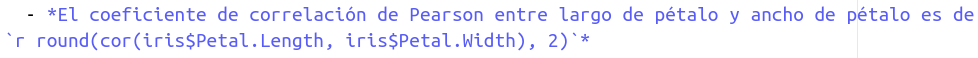

<style>
body
  { counter-reset: source-line 0; }
pre.numberSource code
  { counter-reset: none; }
</style>


&nbsp; 

```{r, echo = FALSE}

# devtools::install_github("hadley/emo")
library("leaflet")
library("xaringanExtra")
library("knitr")
library("DT")

# options to customize chunk outputs
knitr::opts_chunk$set(
  class.source = "numberLines lineAnchors", # for code line numbers
  tidy.opts = list(width.cutoff = 65), 
  tidy = TRUE,
  message = FALSE
 )

htmltools::tagList(
  xaringanExtra::use_clipboard(
    button_text = "<i class=\"fa fa-clipboard\"></i>",
    success_text = "<i class=\"fa fa-check\" style=\"color: #90BE6D\"></i>",
    error_text = "<i class=\"fa fa-times-circle\" style=\"color: #F94144\"></i>"
  ),
  rmarkdown::html_dependency_font_awesome()
)

# this is a customized printing style data frames 
# screws up tibble function
tibble <- function(x, ...) { 
  x <- kbl(x, digits=4, align= 'c', row.names = FALSE) 
   x <- kable_styling(x, position ="center", full_width = FALSE,  bootstrap_options = c("striped", "hover", "condensed", "responsive")) 
   asis_output(x)
}

registerS3method("knit_print", "data.frame", tibble)
```

<!-- skyblue box -->

<div class="alert alert-success">

1. Cree un mapa interactivo con leaflet que muestre el Parque Nacional Corcovado, el Parque Nacional Piedras Blancas y la Reserva Forestal Golfo Dulce (*pista: pueden encontrar las coordenadas usando [google maps](https://www.google.com/maps)*). Para cada sitio añada un marcador usando la función de leaftlet `addAwesomeMarkers`. El mapa debe ser similar a este:

&nbsp;
```{r out.width = '100%', echo = TRUE, as.is = TRUE, echo = TRUE, fig.align='center'}

# cargar paquete
library("leaflet")

# crear mapa vacio
ll_map <- leaflet()

# añadir capas
ll_map <- addTiles(map = ll_map)
 
# definir centro
ll_map <- setView(map = ll_map, lat = 8.534785, lng = -83.552219, zoom = 10)

# añadir marcadores
leaflet::addAwesomeMarkers(map = ll_map, lat = c(8.534785, 8.737077, 8.699383), lng = c( -83.552219, -83.498093, -83.275528))

```
&nbsp;

2. Utilice el paquete [DT](https://rstudio.github.io/DT/) para generar un cuadro (tabla) de los datos `iris`. Debe instalar y cargar el paquete primero. La tabla debe verse igual a esta:

```{r, eval = TRUE, echo = TRUE, results='asis'}

# cargar paquete
library("DT")

# crear tabla
datatable(iris)

```

&nbsp;

&nbsp;

El siguiente código calcula la correlación entre largo y ancho de pétalo para los datos `iris`.

```{r}

cor(iris$Petal.Length, iris$Petal.Width)
```

&nbsp;

1. Incruste el resultado de la correlación en una línea de texto (fuera de un bloque de código). Debe verse así (recuerde redondear):

  - *El coeficiente de correlación de Pearson entre largo de pétalo y ancho de pétalo es de `r round(cor(iris$Petal.Length, iris$Petal.Width), 2)`*

&nbsp;


```{r, echo=FALSE,out.width="100%", fig.align="center"}



```
</div>

&nbsp; 


---

<font size="4">Información de la sesión</font>

```{r session info, echo=F}

sessionInfo()

```
